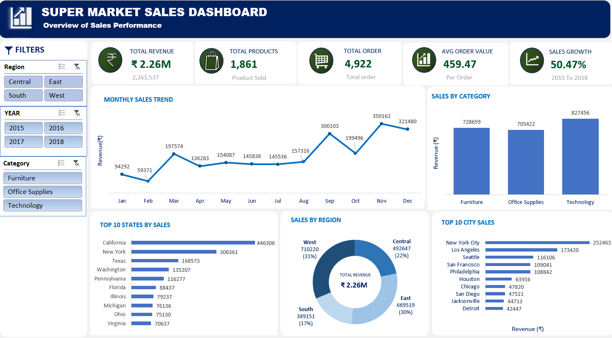

# Superstore_Sales_Dashboard (Excel)
Interactive Sales Dashboard built in Microsoft Excel using Pivot Tables, Pivot Charts and Slicers.

## Project Overview

This project is an interactive Sales Dashboard created in Microsoft Excel to analyze sales performance using the Sample Superstore dataset.

The dashboard enables users to analyze sales across different years, regions, and product categories through interactive slicers and dynamic Pivot Charts.

---

## Tools Used

- Microsoft Excel 2019
- Pivot Tables
- Pivot Charts
- Slicers
- Excel Formulas
- Dashboard Design

---

## Dashboard Preview

---

## KPIs

- Total Revenue
- Total Products Sold
- Total Orders
- Average Order Value (AOV)
- Sales Growth %

---

## Dashboard Features

- Monthly Sales Trend
- Sales by Category
- Top 10 States by Sales
- Top 10 Cities by Sales
- Sales by Region
- Interactive Filters

---

## Dataset

Sample Superstore Dataset

---

## 🚀 Skills Demonstrated

- Data Cleaning
- Data Analysis
- Pivot Tables
- Pivot Charts
- Dashboard Design
- KPI Creation
- Business Insights
